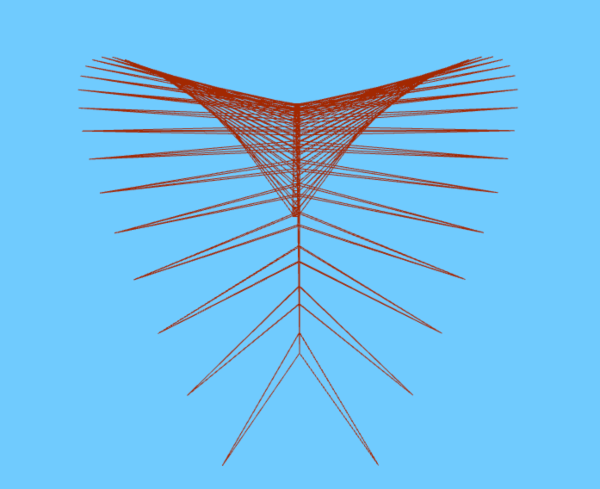
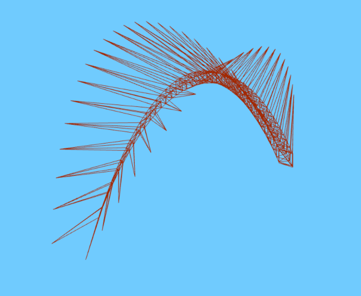
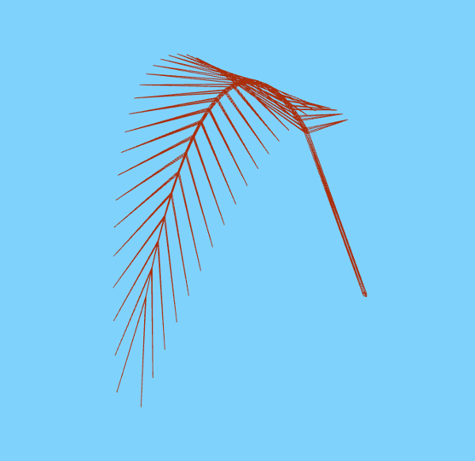
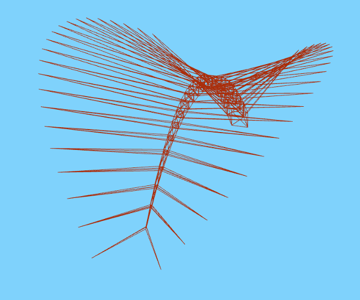

This repository contains a [demo](http://davideprati.com/demo/LeafGeometry) that uses the LeafGeometry.

For now it is es6 only, to use it in your project, download the file `src/LeafGeometry.js`, include it in your application and use this geometry to create a mesh, for example:

```javascript
import LeafGeometry from './leafGeometry.js';
let opt = {
    length: gui.params.length,
    length_stem: gui.params.length_stem,
    width_stem: gui.params.width_stem,
    leaf_width: gui.params.leaf_width,
    leaf_up: gui.params.leaf_up,
    density: gui.params.density,
    curvature: gui.params.curvature,
    curvature_border: gui.params.curvature_border,
    leaf_inclination: gui.params.leaf_inclination
};
let geometry = new LeafGeometry(opt);

object = new THREE.Mesh(geometry, new THREE.MeshPhongMaterial({color: 0x2194CE}));
scene.add(object);

```

To try out this example, clone the repository and:

```javascript
npm install
npm start
npm build
```





